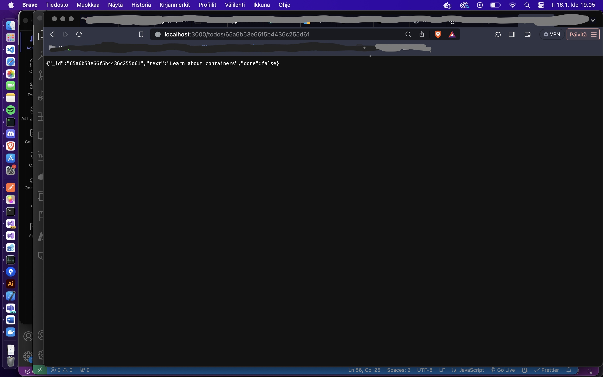

# React kurssi

Oppimistehtäviä Full Stack Open kurssilta. Materiaalit : https://fullstackopen.com/about

#### Julkaisut netissä

* Tehtävä 3.10 backend step10: https://puhelinluettelo-oqv3.onrender.com/api/persons
* Tehtävä 3.11 frontend step11: https://puhelinluettelo-frontend.onrender.com/
* Tehtävä 6.23 : frontend: https://anecdotes-front.onrender.com/  
backend: https://anecdotes-jarno.onrender.com/anecdotes

#### Kuvankaappaukset

### Osa 1

 
 

 
 ### Osa 2

  
  
   
  Phonebook frontend
   
    
     
    Country query
     
    
 

### Osa 3

 

 

### Osa 5

 
Blog app frontend

 

### Osa 6

 
React query

 
Anecdotes redux

 
Unicafe redux

 

### Osa 7

 
Bloglist App with MongoDB

 
Ultimate Hooks

 

### Osa 8
 
Apollo server

 
Books frontend

 
Library database (osa 8C)

 
Library frontend (osa 8C)

### Osa 9
 
Patientor front

 
Flight diary

Exercise Calculator

 

### Osa 10

### Osa 12
Docker 
